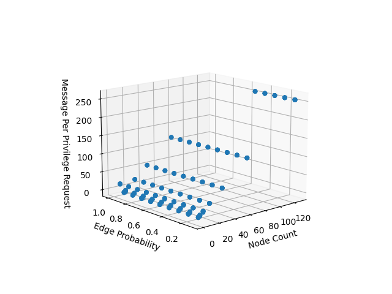

.. include:: substitutions.rst

Implementation, Results and Discussion
======================================

Implementation and Methodology
~~~~~~~~~~~~~~~~~~~~~~~~~~~~~~~~~~~~

To deploy the algorithm, we utilized an event-driven node sourced from the adhoccomputing library. These nodes seamlessly manage events through an internal queue.

Communication among nodes occurs via channels, serving as direct links representing edges in the system's structure.

The algorithm encompasses four primary event types:

1. Requesting privilege
2. Releasing privilege
3. Receiving request messages
4. Receiving reply messages

For comprehensive details and formal definitions, consult the documentation.

To validate the algorithm, we initially construct an appropriate network topology. For the Ricart-Agrawala algorithm, a connected topology is required.

Creating a connected topology involves specifying the number of nodes and the probability of edge connections between pairs of nodes.

We systematically pair nodes and establish edges based on the provided probability. Subsequently, we verify connectivity among all components.

To ensure complete connectivity, any disjoint components are linked by randomly selecting nodes from each and connecting them with an edge.

Key Considerations:

1. When the probability equals 1.0, the topology becomes fully connected.

2. When the probability equals 0.0, although the topology is non-connected, our method ensures that all components remain connected, effectively resembling a linked list.

Once the topology is established, all nodes are activated.

Selected nodes are then prompted to request privilege at random intervals following a Poisson distribution.

The testing process waits until no nodes are requesting privilege.

Finally, data from all nodes is collected and analyzed to derive benchmark results, including:

1. Total privilege requests
2. Instances of duplicate privilege requests
3. Total critical section usage
4. Total critical section releases
5. Count of received request messages
6. Count of received reply messages
7. Count of sent request messages
8. Count of sent reply messages
9. Total forwarded messages

The relationship between total privilege requests and the sum of request and reply messages indicates message complexity.

Moreover, the correlation between total privilege requests and total critical section releases provides practical evidence of fairness and absence of starvation.

Additionally, it's notable that the number of edges inversely correlates with the total forwarded messages, highlighting an interesting aspect of the system's behavior.

Results
~~~~~~~~

Based on its structure, the algorithm sends request messages to all other nodes when a node initiates a privilege request and awaits their responses. Thus, regardless of the scenario, 2*(N-1) messages are expected for a privilege request. Additionally, depending on the connectivity of the topology, messages may need to be delivered to specific nodes. If all nodes are interconnected, with an edge probability of 1.0, no messages are expected to be forwarded. In the case of a linear topology, the worst-case scenario involves forwarding a total of 2*(N-1)(N-2) messages for requests and replies, respectively, totaling 2(N-1)*(N-2) messages.

The figure above illustrates the total number of messages generated per privilege request concerning the number of nodes and edge probability in the topology. Notably, regardless of the edge probability, the total generated messages remain constant at 2*(N-1).

Similarly, the figure demonstrates the total number of messages forwarded per privilege request concerning the number of nodes and edge probability in the topology. As the edge probability approaches 1.0, the number of forwarded messages tends toward 0. Conversely, decreasing edge probability results in an increase in forwarded messages.

Discussion
~~~~~~~~~~

In the event of a node failure in the topology, utilizing system failure detection algorithms allows the failing node to resume operation without affecting others. However, for efficient utilization of this algorithm, establishing a high number of connections between nodes is necessary, which could be costly in terms of hardware resources.